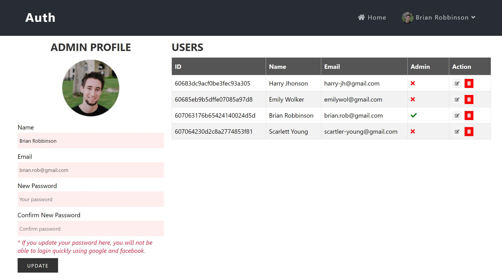
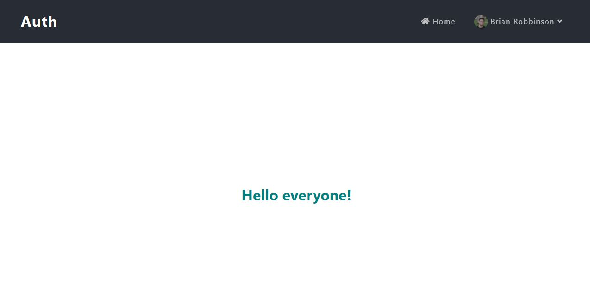
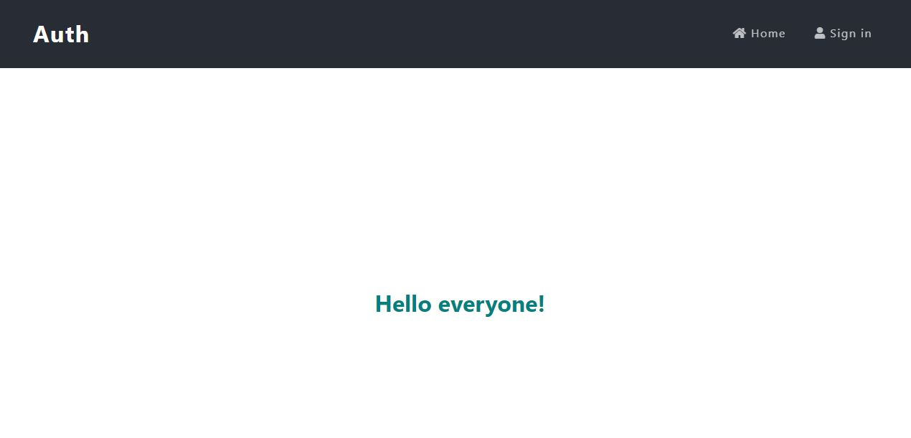
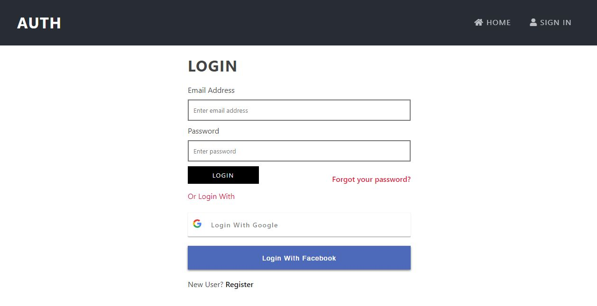
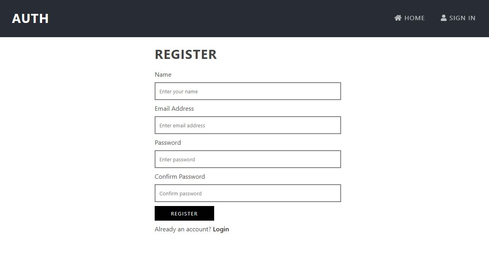
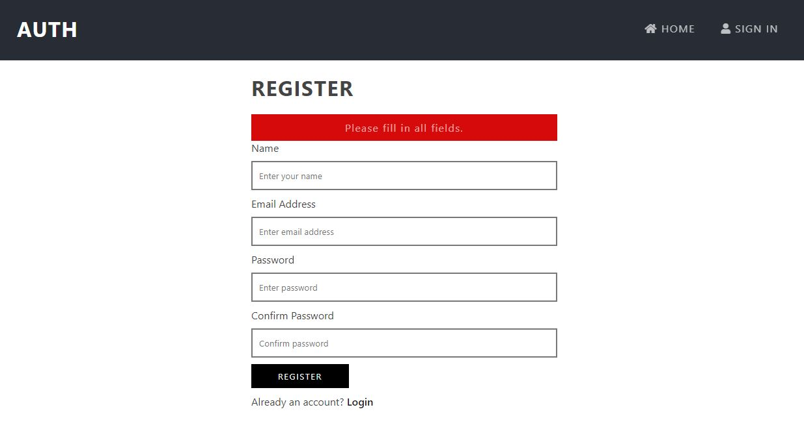
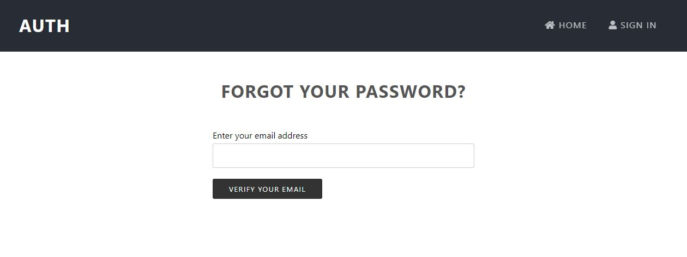

> Finally, I have perfected the user authentication page using the MERN Stack + Redux.

[You can see screenshots of the messenger below](#screenshots)

> Include:
>
> - Register, login with validation form.
> - Quick login with Google, Facebook.
> - Forgot password, reset password and register a new account by Email verification.
> - Update personal information (name, password and avatar)
> - Change permissions and delete user accounts with Admin.

## <a name="screenshots">Screenshots</a>

  <h3 style="margin-top: 50px; font-size: 35px">Admin page</h3>
  

  <h3 style="margin-top: 50px; font-size: 35px">Home with login</h3>
  

  <h3 style="margin-top: 50px; font-size: 35px">Home without login</h3>
  

  <h3 style="margin-top: 50px; font-size: 35px">Login</h3>
  

  <h3 style="margin-top: 50px; font-size: 35px">Register</h3>
  

  <h3 style="margin-top: 50px; font-size: 35px">Validate register</h3>
  

  <h3 style="margin-top: 50px; font-size: 35px">Forgot password</h3>
  

